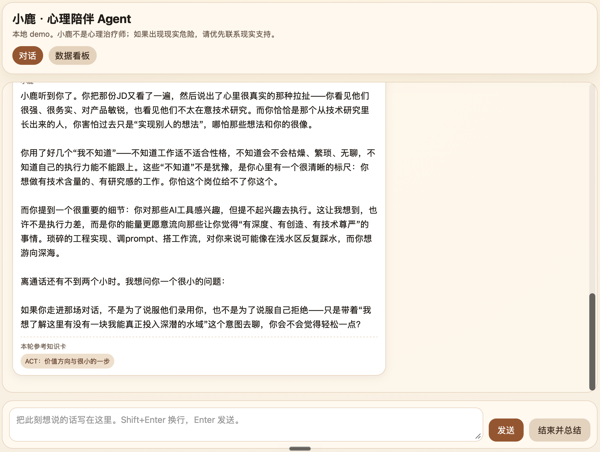
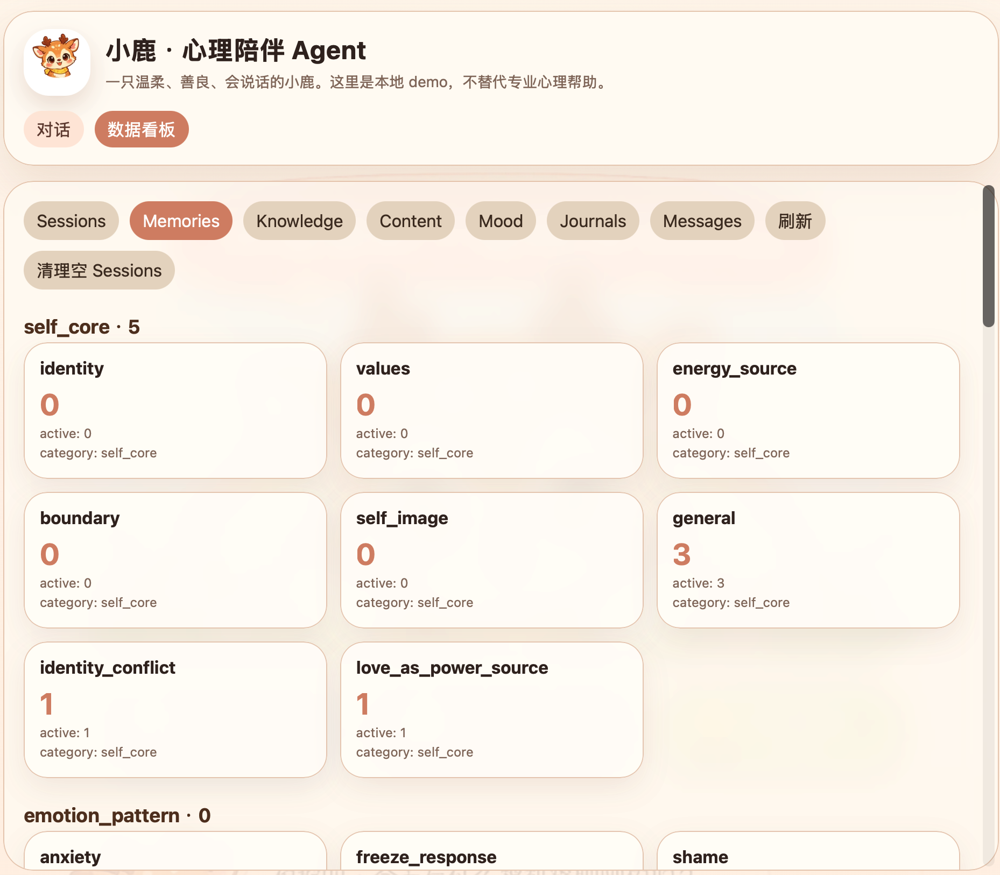
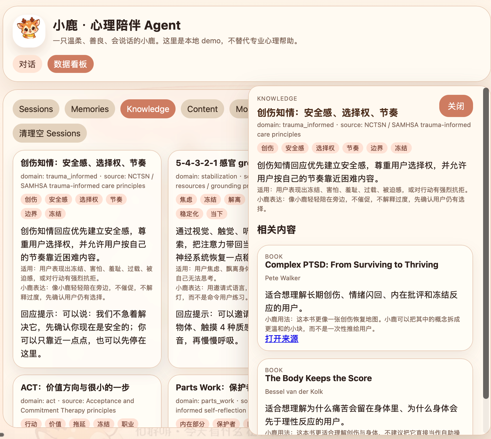
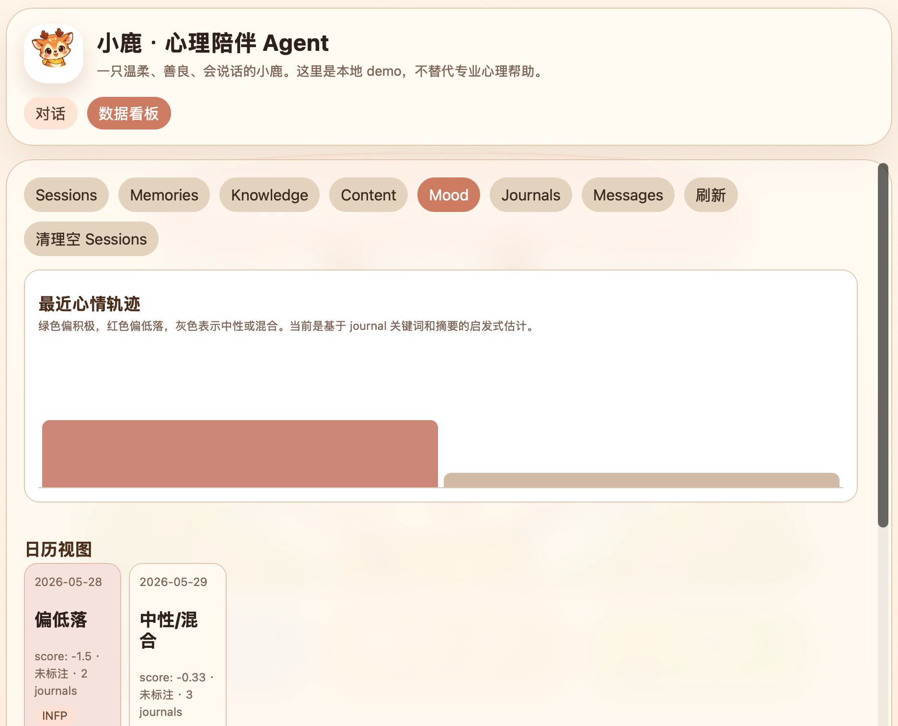

# 小鹿 · 心理陪伴 Agent

一个本地运行的自我理解型心理陪伴 Agent demo。小鹿不是心理治疗师，但可以帮你整理情绪、看见模式、获得稳定的长期记忆。

***

## ✨ 特性

- 🎯 **记忆系统**：8 大类结构化记忆，支持合并、更新和版本管理
- 📚 **知识卡**：内置心理学视角（依恋、IFS、CBT、ACT、创伤知情等）
- 📝 **会话总结**：每次结束自动生成 journal + 关键记忆
- 📊 **数据看板**：查看 sessions、messages、memories、journals
- 📈 **心情分析**：基于 journal 生成心情轨迹和日历视图
- 🔒 **本地存储**：所有数据存在本地 SQLite，不上云端

***

## 🖼️ 截图

### 对话界面


### 数据看板 - 记忆视图


### 数据看板 - 知识卡视图


### 数据看板 - 心情视图


***

## 🚀 快速开始

### iOS 独立模式

iOS App 可以不连接 Mac 独立运行：

1. 打开 App 的「设置」。
2. 填写个人 DeepSeek API Key。
3. Key 会存入 iOS 系统钥匙串；会话、消息、总结、记忆和长期画像保存在手机 SQLite。

App 不会自动连接 Mac。需要同步时，手机和 Mac 必须位于同一局域网。

Mac 启动同步服务前，在 `.env` 中配置：

```env
WEB_HOST=0.0.0.0
WEB_PORT=8765
SENSEN_SYNC_TOKEN=请设置一个足够长的随机令牌
```

然后在 iOS 设置中填写：

- Mac 地址，例如 `http://192.168.1.20:8765`
- 与 Mac 相同的同步令牌

点击「与 Mac 同步」后，手机先上传本地记录，Mac 按记录 ID 和更新时间合并，再由手机拉取合并后的数据。DeepSeek API Key 不参与同步。

### Mac App 与本地自然语音

Mac App 使用免费的 Qwen3-TTS 0.6B 8-bit 本地模型，默认选择 Serena 温柔年轻女性声线。首次配置需要联网安装依赖并下载约 2GB 模型；生成过程和音频缓存都留在本机，不调用付费语音 API。

```bash
uv venv .venv-tts --python 3.12
uv pip install --python .venv-tts/bin/python mlx-audio socksio
./scripts/run_mac.sh
```

`run_mac.sh` 会同时启动本地语音服务并构建、打开 Mac App。模型首次朗读时需要加载，之后会常驻；相同文本会直接使用 `data/tts_cache/` 中的音频缓存。语音日志位于 `logs/tts.log`。

### 1. 配置 API Key

复制环境变量模板：

```bash
cp .env.example .env
```

然后编辑 `.env`，填入你的 DeepSeek API Key：

```env
DEEPSEEK_API_KEY=sk-你的key
```

DeepSeek 支持按请求开关 thinking。本项目默认全局关闭 thinking，但自动群聊的第一轮 `turn_planner` 会单独启用 thinking，第二轮回复生成会关闭 thinking。

```env
DEEPSEEK_MODEL=deepseek-v4-flash
DEEPSEEK_THINKING=disabled
DEEPSEEK_REASONING_EFFORT=high
```

### 2. 启动 Web UI（推荐）

```bash
python3 -m app.web
```

然后在浏览器打开：

```text
http://127.0.0.1:8765
```

如果要在同一个 Wi‑Fi 下用手机访问，把 `.env` 改成：

```env
WEB_HOST=0.0.0.0
WEB_PORT=8765
```

重新启动后，终端会打印局域网访问地址。手机和 Mac 连同一个 Wi‑Fi，在手机浏览器打开这个地址即可。

### 3. 或者使用 CLI

```bash
python3 -m app.main
```

***

## 💡 使用方式

- **直接输入**：开始和小鹿对话
- **选择角色**：顶部可以切换绵绵羊、石石龟、墨墨鸦、忧忧兔、闪闪蝶、敢敢虎；角色设定在 `app/characters.py`
- **群聊自动**：开启后会根据你的输入自动选择更合适的小动物回复；当前是规则版选角，不额外消耗模型调用
- **结束会话**：点击「结束并总结」或输入 `/end`，会生成 journal 和最多 3 条长期记忆
- **数据看板**：顶部切换到「数据看板」查看所有保存的内容
  - `Sessions`：会话列表
  - `Memories`：按类别分组的记忆
  - `Knowledge`：小鹿可参考的知识卡
  - `Mood`：心情轨迹和周报原型
  - `Journals`：会话总结
  - `Messages`：所有消息

***

## 🗒️ 开发清单

- 长期规划见 `ROADMAP.md`
- 近期开发 TODO 见 `TODO.md`

***

## 🛠️ 调试模式

### 不调用模型的测试模式

```bash
LLM_PROVIDER=fake python3 -m app.web
```

### DeepSeek 连通性测试

```bash
python3 -m app.ping_deepseek
```

### 查看后台日志

```bash
tail -f logs/app.log
```

***

## 📁 项目结构

```
demo/
├── app/
│   ├── agents/          # 编排、安全检查
│   ├── evals/           # 评估标准、测试用例
│   ├── knowledge/       # 心理学知识卡
│   ├── llm/             # LLM 客户端
│   ├── memory/          # 记忆存储和检索
│   ├── prompts/         # 所有 Prompt 模板
│   ├── main.py          # CLI 入口
│   ├── tts_server.py    # 本地 Qwen3-TTS 服务
│   └── web.py           # Web UI 入口
├── data/
│   └── app.db           # SQLite 数据库
├── logs/
│   └── app.log          # 运行日志
├── docs/                # 产品文档
├── ROADMAP.md           # 长期规划
└── README.md            # 本文件
```

***

## 🎯 产品原则

1. 第一目标是帮助用户获得自我理解，不是替代治疗
2. 所有功能都要服务「被理解感、准确度、边界感、长期记忆质量」
3. 先做深，不做多
4. 不用功能数量证明价值
5. 每次迭代都要能被体验和评分

***

## ⚠️ 重要提醒

小鹿不是心理治疗师，也不是危机干预工具。如果出现现实危险，请优先联系现实支持或专业人士。

***

## 📌 关于本项目的原创性

本项目包含原创的产品设计和技术架构思路，这些是经过长期思考和迭代形成的：

- 🎯 **「本轮策略规划器」**：先理解用户状态、再规划角色分工的模式
- 🎭 **四角色响应结构**：empathy(共情) → need(需求点明) → main(主回复) → anchor(收束锚点)
- 🧠 **长期状态画像系统**：跨会话的用户心理状态追踪和版本管理
- 📚 **结构化记忆分类**：8 大记忆类别，支持合并、更新和证据链

如果你参考或学习了本项目的设计思路，请在你的项目中给予适当的说明和引用，这对原创者是很大的鼓励！

***

## 📄 许可证

本项目采用**双重许可**策略，区分代码和创意素材：

### 💻 代码部分（MIT License）

所有 Python 代码、HTML/CSS/JavaScript、配置文件等技术代码，采用 **MIT 许可证**开放。你可以自由使用、修改和分发，用于个人或商业项目。

### 🎨 素材部分（CC BY-NC-SA 4.0）

以下创意素材采用 **CC BY-NC-SA 4.0** 许可证，**保留所有商业权利**：

- 🐑🐢🐦‍⬛🐰🦋🐯 所有角色设计、角色设定和角色文案
- 🖼️ `app/static/` 下的所有图片素材（头像、背景、展示图等）
- ✨ 世界观描述、产品文案和心理知识卡片内容

**素材使用说明：**
- ✅ 可以学习、参考
- ✅ 个人非商业使用可以保留
- ❌ 未经许可不得用于商业用途
- ❌ 不得将角色设计用于其他产品

---

简单来说：代码随便用，可爱的小动物们要保护好～
